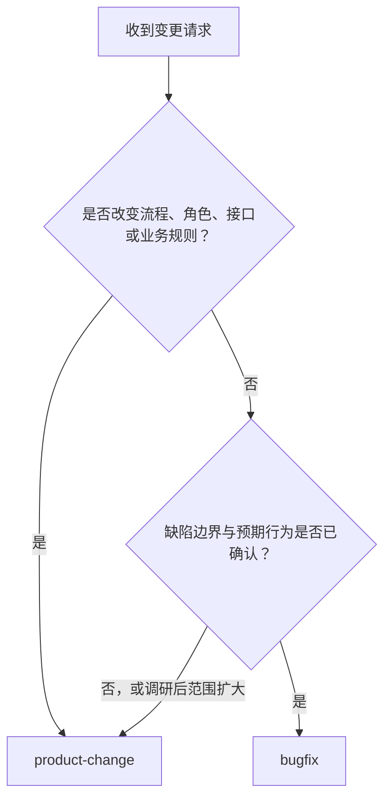
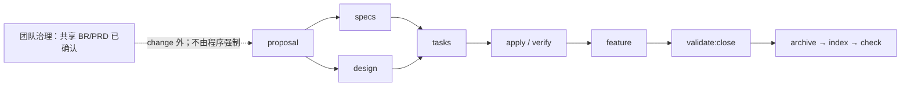

# AI 全栈 OpenSpec 工作流

一套面向 AI 协作开发的可移植交付工作流：用 OpenSpec 管理 change 内的可执行行为契约，用精简 BR/PRD 管理 change 外的产品目标，并以确定性的导航、历史和 closeout evidence 支持审查与关闭。

> 当前版本：`2.1.0`
>
> 环境下限：Node.js `>=20.19.0`、Git、npm、`@fission-ai/openspec@1.5.0`

## 目录

- [适用场景](#适用场景)
- [核心模型](#核心模型)
- [五分钟快速开始](#五分钟快速开始)
- [选择 bugfix 或 product-change](#选择-bugfix-或-product-change)
- [事实来源与 artifact graph](#事实来源与-artifact-graph)
- [完整交付生命周期](#完整交付生命周期)
- [完成第一个 bugfix](#完成第一个-bugfix)
- [完成第一个 product change](#完成第一个-product-change)
- [任务、证据与 FEATURE](#任务证据与-feature)
- [Closeout JSON](#closeout-json)
- [关闭单个 change](#关闭单个-change)
- [程序门禁与团队治理](#程序门禁与团队治理)
- [命令参考](#命令参考)
- [CI 接入](#ci-接入)
- [安装器与升级](#安装器与升级)
- [目录结构](#目录结构)
- [故障排查](#故障排查)
- [维护与相关文档](#维护与相关文档)

## 适用场景

本项目适合希望让 AI 参与实现、同时保留明确行为契约、验证证据和关闭审查的团队。它提供两条路径：

- 对边界明确的小缺陷使用 `bugfix`；
- 对新功能、跨角色流程、接口或业务规则变化使用 `product-change`。

它重点解决以下问题：

- AI 如何只加载当前任务需要的最小上下文；
- 产品目标、可执行行为、技术设计、实现状态和交付结论分别放在哪里；
- 多个 changes 如何共享 BR/PRD，而不在每个 change 中复制整套产品文档；
- 如何在关闭单个 change 前检查任务结构、质量 evidence、引用完整性和适用门禁；
- 如何确定性生成导航与机器历史，降低长期维护和审计成本。

本项目不是：

- 产品管理或需求评审的替代品；
- 合规认证、证据充分性或语义正确性的自动证明系统；
- `closeout.json.command` 的命令执行器；
- 通过 hash、base ref 或 full history 强制证明归档不可变的系统。

## 核心模型

工作流把规则分为三个层次。三者都应遵守，但执行方式不同。

| 层次 | 主要事实 | 执行方式 |
|---|---|---|
| 团队流程治理 | product change 前完成并确认共享 BR/PRD；无法实现、取消或延期 task 的用户确认；归档不得修改 | 团队评审与协作 |
| OpenSpec artifact graph | proposal、specs、design、tasks、feature 的生成和依赖关系 | OpenSpec Schema |
| 程序门禁 | strict validation、closeout 结构与引用、evidence 文件、适用 gate、生成文件漂移 | 脚本、CLI 与 CI |

事实按职责分层：

- BR/PRD 定义 change 外的业务目标、产品范围和结果级验收；
- specs 定义系统可执行行为，精确场景只在 specs 中维护；
- `design.md` 记录本 change 的技术决策；
- 源代码、`tasks.md` 和验证 evidence 共同反映实现状态；
- FEATURE 只记录有实现和验证证据支持的交付结论；
- `SPEC.md` 与 `openspec/change-history.json` 是生成的导航和历史，不得手工编辑。

## 五分钟快速开始

### 前置条件

- Node.js `>=20.19.0`
- Git 和 npm
- `@fission-ai/openspec@1.5.0` 已安装，并可通过 `openspec` 命令调用

### PowerShell

```powershell
$workflowRepo = "D:\path\to\ai-fullstack-openspec-workflow"
$targetProject = "D:\path\to\your-project"

Set-Location $workflowRepo
npm ci
npm run verify
node dist\bin\workflow.js install --target $targetProject

Set-Location $targetProject
node scripts\validate-schemas.js
node scripts\openspec-governance.js index
node scripts\openspec-governance.js check
```

### Bash

```bash
workflow_repo="/path/to/ai-fullstack-openspec-workflow"
target_project="/path/to/your-project"

cd "$workflow_repo"
npm ci
npm run verify
node dist/bin/workflow.js install --target "$target_project"

cd "$target_project"
node scripts/validate-schemas.js
node scripts/openspec-governance.js index
node scripts/openspec-governance.js check
```

`npm run verify` 是工作流源仓库的完整验证入口。源仓库维护 TypeScript，`dist/` 是不跟踪的编译产物；安装到目标项目的是 emitted JavaScript，因此目标项目不需要 TypeScript 或 ts-node。目标环境仍需提供 OpenSpec `1.5.0` CLI。

安装器会创建必要目录、安装两个 schemas 与模板、复制治理/校验脚本和标准指南，并生成初始 `SPEC.md` 与 `openspec/change-history.json`。已有文件的冲突和升级策略见[安装器与升级](#安装器与升级)。

## 选择 bugfix 或 product-change



| 选择 | 使用条件 | 原生核心流程 |
|---|---|---|
| `bugfix` | 缺陷边界明确、预期行为已确认，不改变流程、角色、接口或业务规则 | `proposal -> specs -> tasks -> apply` |
| `product-change` | 新功能、管理台、跨角色流程、接口/数据/权限变化或新增业务规则 | `proposal -> {specs ∥ design} -> tasks -> apply -> feature` |

只有同时满足以下条件时才使用 `bugfix`：

- 问题边界小且可观察；
- 预期行为已经确认；
- 不增加角色流程、接口契约或业务规则；
- 可用聚焦回归测试证明修复。

如果调研发现范围扩大，停止当前 bugfix，并迁移为 `product-change`。不要为了缩短 artifact 流程而把产品变化包装成 Bug。

## 事实来源与 artifact graph

| 问题 | 事实来源 |
|---|---|
| 为什么做、产品目标是什么 | `docs/requirements/REQ-*/BR-*.md`、`PRD-*.md` |
| 系统当前必须如何行为 | `openspec/specs/<capability>/spec.md` |
| 本 change 改变什么行为 | `openspec/changes/<change>/specs/<capability>/spec.md` |
| 技术上如何实现 | 本 change 唯一的 `design.md` |
| 实现与验证到了哪里 | 源代码、`tasks.md`、验证 evidence |
| 哪些能力已真实交付 | change `feature.md` 与共享 `FEATURE.md` |
| 去哪里找活动与历史上下文 | 生成的 `SPEC.md` 与 `openspec/change-history.json` |

BR/PRD 只表达外层产品目标和结果级验收。精确的 SHALL/MUST、WHEN/THEN 与异常行为只写在 specs 中。一个共享 BR/PRD 可以对应多个可独立交付的 changes。

AI 开始工作时按以下顺序加载上下文：

1. 读取根 `SPEC.md` 定位受影响 capability 和活动 change；
2. 只读取 `openspec/specs/` 下受影响的当前规格；
3. 读取修改同一 capability 的活动 changes；
4. 需要 Requirement 级演进时读取 `openspec/change-history.json`；
5. 只在回归、冲突或设计依据需要时读取相关 archive。

## 完整交付生命周期



product change 的关键关系如下：

- `proposal` 是独立 root，不依赖 change 内的 `br.md` 或 `prd.md`；
- change 内的 `br.md` 与 `prd.md` 只是共享文档的轻量绑定，`prd` 等待 `br`，但两者都不是 `proposal` 的前置；
- 团队在 change 外完成并确认共享 BR/PRD，该顺序不由 Schema、脚本或 CI 强制；
- `proposal` 完成后，`specs` 与唯一的 `design.md` 可并行；
- `tasks` 等待 specs 和 design，并作为 `apply` 的进度事实；
- `feature` artifact ready 只表示可以开始记录交付，不表示 change 已关闭；
- change 只有在校验、归档、导航/历史重建和治理检查完成后才关闭。

bugfix 不包含 product PRD/FEATURE 交付链，但仍需稳定的 delta Requirement ID、真实回归 evidence、四项 gate 适用性决策和标准关闭流程。

## 完成第一个 bugfix

下面以边界明确的登录超时缺陷为例。先创建 change 并查看当前可生成的 artifact：

```powershell
openspec new change fix-login-timeout --schema bugfix
openspec status --change fix-login-timeout
openspec instructions proposal --change fix-login-timeout
```

然后按顺序完成：

1. **加载最小上下文**：读取根 `SPEC.md`、受影响的当前 spec，以及修改同一 capability 的活动 changes。
2. **定义有界修复**：在 `proposal.md` 中描述可观察缺陷、已确认的预期行为、范围、非目标、风险与回滚方式。如果预期行为仍不明确或范围扩大，停止并迁移到 `product-change`。
3. **编写 delta specs**：为每个受影响 capability 写完整的 ADDED/MODIFIED/REMOVED/RENAMED delta。每项 Requirement 使用稳定 ID、SHALL/MUST 和精确 WHEN/THEN Scenario。
4. **生成并执行 tasks**：复现缺陷，保留失败证据，实施最小修复，运行聚焦回归测试，并记录适用质量门禁。
5. **准备 closeout**：填写四项 gate 的真实适用性、evidence 记录和项目内 artifact。
6. **校验并关闭**：

```powershell
node scripts\validate-close.js fix-login-timeout
node bin\workflow.js close fix-login-timeout --target .
```

bugfix 不需要 product PRD/FEATURE trace 字段，但所有 delta Requirements 仍必须使用稳定 ID。调研中若出现新流程、角色、接口、数据规则或产品验收，应升级为 product change。

## 完成第一个 product change

### 1. 先建立共享需求包

团队先从模板创建共享需求包：

```text
docs/requirements/REQ-001-operations-console/
  README.md
  BR-001.md
  PRD-001.md
  FEATURE.md
```

BR 描述业务问题、证据、目标与约束；PRD 描述用户、范围、产品规则和结果级 acceptance IDs。团队应在启动 product change 前完成并确认共享 BR/PRD，但这是 change 外的流程治理，不是 Schema、脚本或 CI 门禁。

### 2. 创建并推进 change

```powershell
openspec new change add-operations-console --schema product-change
openspec status --change add-operations-console
openspec instructions proposal --change add-operations-console
```

按以下顺序推进：

1. 在 change 的 `br.md` 和 `prd.md` 中绑定共享 BR/PRD，不复制共享文档全文。
2. 完成 `proposal.md`，只表达 Why、What Changes、Capabilities 与 Impact。
3. proposal 完成后，并行编写 delta specs 与本 change 唯一的 `design.md`。
4. specs 和 design 都完成后生成 `tasks.md`，按依赖排序并使每项可独立验证。
5. 实施 change，运行适用质量门禁，在 tasks 或 feature evidence 中记录真实命令和结果。
6. 为所有 delta Requirements 使用稳定 ID，并把每个 ID 恰好一次映射到一个或多个 PRD acceptance IDs。
7. 在 change `feature.md` 中记录本地结果/evidence IDs，并把结果 IDs 同步到共享 `FEATURE.md` 台账。
8. 填写 product-change `closeout.json`，校验并关闭显式指定的 change。

OpenSpec 会通过 `status` 和 `instructions` 告知下一份可生成的 artifact：

```powershell
openspec status --change add-operations-console
openspec instructions specs --change add-operations-console
openspec instructions design --change add-operations-console
```

如果实际 OpenSpec 输出显示 artifact 尚未解锁，应先完成它声明的前置 artifact，不要绕过 graph 手工伪造完成状态。

## 任务、证据与 FEATURE

### `tasks.md`

`tasks.md` 是实现进度事实，而不是关闭结果的装饰性清单：

- `[x]` 和 `[X]` 表示完成；
- `[ ]`、`[-]`、`[~]` 或其他真实非 `x` marker 表示未完成，并产生 `TASKS_INCOMPLETE` warning；
- fenced code block 中的 checkbox 示例不计入真实任务；
- 缺失、不可读或完全没有真实 checkbox 的 `tasks.md` 产生 blocking `TASKS_INVALID`；
- AI 应继续完成所有仍可实现的 task。

如果 AI 判断 task 无法实现、已取消或需要延期，关闭前必须：

1. 向用户说明原因；
2. 说明对本次交付、Requirement 和 FEATURE 声明的影响；
3. 给出后续安排；
4. 修正任何不再真实的交付声明；
5. 在执行 `workflow close` 前取得用户明确确认。

该确认属于团队流程治理。程序不判断 task 是否真的无法实现，也不持久化或验证 waiver、approval，且没有 `--allow-incomplete-tasks` 参数。

### 质量 evidence

closeout evidence 应包含：

- 稳定且唯一的 evidence ID；
- evidence 类型；
- `status` 为 `passed`；失败或未知结果不得伪装成可用于关闭的 evidence；
- 实际运行过的命令记录；
- 位于项目根目录内、真实存在的普通文件 artifact。

security、migration、browser、rollback gate 为适用时，必须引用类型匹配且状态为 `passed` 的 evidence。`closeout.json` 中的 `command` 只记录，不会被关闭校验执行。

### FEATURE

FEATURE 只记录有实现和验证 evidence 支持的交付结论：

- `feature` artifact ready 只表示前置 artifacts 已具备、可以开始编写；
- change `feature.md` 的每条交付结论使用稳定结果 ID，并逐条关联 evidence IDs；
- product change 把本地结果 IDs 同步到共享 `FEATURE.md` 台账，并把对应 change 行标记为 `ready`；
- 没有实现 evidence 时不得声明 ready；
- FEATURE ready 不等于 change 已完成关闭。

## Closeout JSON

product change 的最小结构如下。字段值必须替换为当前 change 的真实引用和 evidence：

```json
{
  "version": 1,
  "prd": "docs/requirements/REQ-001-operations-console/PRD-001.md",
  "sharedFeature": "docs/requirements/REQ-001-operations-console/FEATURE.md",
  "requirements": [
    { "id": "OPS-001", "acceptanceIds": ["PA-001"] }
  ],
  "featureResults": [
    { "id": "FR-001", "evidenceIds": ["EV-TEST-001"] }
  ],
  "evidence": [
    {
      "id": "EV-TEST-001",
      "type": "test",
      "status": "passed",
      "command": "npm test",
      "artifact": "artifacts/closeout/test-report.json"
    }
  ],
  "gates": {
    "security": {
      "applicable": false,
      "reason": "No security boundary changed.",
      "evidenceIds": []
    },
    "migration": {
      "applicable": false,
      "reason": "No data migration.",
      "evidenceIds": []
    },
    "browser": {
      "applicable": false,
      "reason": "No browser surface changed.",
      "evidenceIds": []
    },
    "rollback": {
      "applicable": false,
      "reason": "No deployable change.",
      "evidenceIds": []
    }
  }
}
```

关键规则：

- 四个 gates 必须全部存在；
- 适用 gate 必须引用类型匹配且状态为 `passed` 的 evidence；
- 不适用 gate 必须给出真实理由，且 `evidenceIds` 为空；
- evidence artifact 必须是项目内真实存在的普通文件，不能使用逃逸项目根目录的路径；
- `command` 只是记录，校验器不会执行；
- product change 需要 PRD、共享 FEATURE、Requirement/acceptance 和 FEATURE/evidence 引用；
- bugfix 不使用这些 product trace 字段，但仍需要 evidence、四项 gates 和稳定 delta Requirement IDs。

完整模板：

- [product-change closeout 模板](docs/closeout-templates/product-change.json)
- [bugfix closeout 模板](docs/closeout-templates/bugfix.json)

## 关闭单个 change

### 源仓库

未提前执行 sync 时，让标准 close wrapper 应用 delta：

```powershell
npm run validate:close -- <change>
node dist/bin/workflow.js close <change> --target .
```

### 安装目标

```powershell
node scripts/validate-close.js <change>
node bin/workflow.js close <change> --target .
```

`validate:close` 只校验显式指定的单个活动 change；`close` 在相同校验通过后依次执行：

1. OpenSpec archive；
2. 重建 `SPEC.md`；
3. 重建 `openspec/change-history.json`；
4. 执行治理检查。

### 已经提前 sync

如果已经执行 `/opsx:sync` 并应用了 delta，关闭时必须避免重复同步：

```powershell
node bin/workflow.js close <change> --skip-specs --target .
```

`--skip-specs` 只允许用于 `close`。未 sync 却使用它，可能在未应用 delta 的情况下归档；已经 sync 却省略它，可能重复应用同一 delta。

### 归档后 finalization 失败

如果 archive 已成功，但 index 或 check 失败，wrapper 会明确报告 change 已归档。修复原因后运行：

```powershell
node bin/workflow.js index --target .
node bin/workflow.js check --target .
```

不要因为 finalization 失败而重新创建或改写已经归档的 change。

## 程序门禁与团队治理

| 检查 | 结果 | 是否由程序强制 |
|---|---|---:|
| 未完成真实 task checkbox | `TASKS_INCOMPLETE` warning；继续关闭 | 否 |
| `tasks.md` 缺失、不可读或无真实 checkbox | `TASKS_INVALID` | 是 |
| 四项 gate 矩阵完整 | 缺失或不合法时 `GATE_INVALID` | 是 |
| 适用 gate 有 matching passed evidence | 无效时 `GATE_INVALID` | 是 |
| evidence artifact 位于项目内且真实存在 | 无效时 `EVIDENCE_INVALID` | 是 |
| product FEATURE/evidence 引用及共享台账完整 | 无效时 `FEATURE_TRACE_INVALID` / `SHARED_FEATURE_INVALID` | 是 |
| product Requirement/PRD acceptance 引用完整 | 无效时 `PRD_TRACE_INVALID` / `REQUIREMENT_INVALID` | 是 |
| bugfix delta Requirement ID 稳定 | 无效时 `REQUIREMENT_INVALID` | 是 |
| OpenSpec strict validation | 失败时停止关闭 | 是 |
| 不可实现、取消或延期 task 已获用户确认 | 团队协作 | 否 |
| product change 开始前共享 BR/PRD 已确认 | 团队协作 | 否 |
| 已归档内容不得修改 | 团队协作 | 否 |

只有 warnings 且无 blocking diagnostics 时，单 change 关闭校验保持成功退出码，标准 close 继续归档。warning 仍会在 archive 前显示，提醒 AI 和用户处理治理责任。

程序能证明的是结构、引用、项目内文件存在和声明 evidence；它不能证明：

- PRD 与 Requirement 语义一致；
- evidence 足够支持交付结论；
- N/A 理由合理；
- 用户确认真实发生；
- archive 在所有分支和历史中不可变。

已归档 change 不得修改仍是团队规则。历史需要修正时，创建新的 delta/correction change，而不是改写过去。

`check` 会发现当前工作树相对 `HEAD` 的已提交 archive 修改或删除；这只是局部漂移检查，不是跨分支、base ref、full history 或 hash 层面的归档不可变性证明。

## 命令参考

### 源仓库

源仓库维护 TypeScript 并通过 npm scripts 统一构建和验证。

| 命令 | 用途 |
|---|---|
| `npm ci` | 按 lockfile 安装精确的开发依赖 |
| `npm run build` | 清理并把 TypeScript 编译到不跟踪的 `dist/` |
| `npm test` | 构建并运行 compiled test suite |
| `npm run index` | 重建 `SPEC.md` 和 `openspec/change-history.json` |
| `npm run check` | 检查必要结构、历史解析诊断、生成文件漂移和当前工作树的 archive 修改 |
| `npm run validate:schemas` | 校验两个 OpenSpec schemas |
| `npm run validate:changes` | 枚举所有活动 change 并逐项执行 strict validation |
| `npm run validate:close -- <change>` | 校验一个显式指定的活动 change |
| `npm run verify` | 构建、测试、index、check、schema 校验和全部活动 change 校验 |
| `node dist/bin/workflow.js install --target <project> [--force]` | 把 emitted workflow assets 安装到目标项目 |
| `node dist/bin/workflow.js close <change> [--skip-specs] --target <project>` | 执行校验、归档、index 和 check |

### 安装目标

| 命令 | 用途 |
|---|---|
| `node scripts/openspec-governance.js index` | 确定性重建导航和机器历史 |
| `node scripts/openspec-governance.js check` | 检查结构、生成文件漂移、解析诊断和当前工作树的 archive 修改 |
| `node scripts/validate-schemas.js` | 校验已安装 schemas |
| `node scripts/validate-changes.js` | 严格校验每个活动 change |
| `node scripts/validate-close.js <change>` | 校验一个显式指定的 closeout |
| `node bin/workflow.js validate:close <change> --target .` | 通过统一 CLI 执行同一单 change 校验 |
| `node bin/workflow.js index --target .` | 通过统一 CLI 重建导航和历史 |
| `node bin/workflow.js check --target .` | 通过统一 CLI 执行治理检查 |
| `node bin/workflow.js close <change> --target .` | 校验、归档、重建索引并执行检查 |

`validate:changes` 和 `validate:close` 是不同门禁：前者从文件系统枚举所有活动 changes；后者只处理命令行显式给出的一个 change。只有 `close` 会归档。

### 常用 OpenSpec 命令

| 命令 | 用途 |
|---|---|
| `openspec new change <id> --schema <schema>` | 使用指定 Schema 创建 change |
| `openspec status --change <id>` | 查看 artifact 状态和可生成项 |
| `openspec instructions <artifact> --change <id>` | 获取指定 artifact 的生成指引 |
| `openspec validate <id> --strict` | 对一个 change 执行原生 strict validation |
| `openspec archive <id>` | 原生归档；日常关闭优先使用本项目的 guarded wrapper |

## CI 接入

CI 只执行真实命令或脚本能够证明的检查。不要把团队 BR/PRD 确认、用户确认或跨分支 archive 不可变性写成 CI 已证明的事实。

### 工作流源仓库

以下 GitHub Actions 示例验证本仓库自身：

```yaml
name: verify

on:
  pull_request:
  push:

jobs:
  verify:
    runs-on: ubuntu-latest
    steps:
      - uses: actions/checkout@v6
      - uses: actions/setup-node@v6
        with:
          node-version: 20.19.0
          cache: npm
      - run: npm ci
      - run: npm run verify
```

### 已安装目标项目

目标项目需要让 OpenSpec `1.5.0` 可从命令行调用，再运行 emitted JavaScript：

```yaml
name: openspec-governance

on:
  pull_request:

jobs:
  validate:
    runs-on: ubuntu-latest
    steps:
      - uses: actions/checkout@v6
      - uses: actions/setup-node@v6
        with:
          node-version: 20.19.0
      - run: npm install --global @fission-ai/openspec@1.5.0
      - run: node scripts/openspec-governance.js index
      - run: git diff --exit-code -- SPEC.md openspec/change-history.json
      - run: node scripts/validate-schemas.js
      - run: node scripts/validate-changes.js
      - run: node scripts/openspec-governance.js check
      - run: git diff --check
```

示例使用 GitHub 官方的 [`actions/checkout@v6`](https://github.com/actions/checkout) 与 [`actions/setup-node@v6`](https://github.com/actions/setup-node)。如果团队使用其他 CI 平台，保持命令顺序和失败语义一致即可。

`node scripts/validate-changes.js` 会：

1. 枚举 `openspec/changes/` 的一级目录；
2. 排除 `archive`、隐藏目录和非目录项；
3. 按英文名称排序；
4. 对每个活动 change 运行 `openspec validate <change> --strict`；
5. 收集全部失败后统一以非零状态退出。

## 安装器与升级

### 安装内容

安装器向目标项目写入：

- 两个 OpenSpec schemas 及其模板；
- requirements 与 closeout 模板；
- emitted `scripts/*.js`、`bin/workflow.js` 和必要的 `lib/*.js`；
- `docs/FULLSTACK_WORKFLOW.md` 与 `docs/QUALITY_GATES.md`；
- 初始 `SPEC.md` 与 `openspec/change-history.json`；
- 记录工作流版本和受管文件列表的 `.ai-workflow.json`；
- 必要的 `openspec/specs/` 和 `openspec/changes/archive/` 目录。

目标项目只运行 emitted JavaScript，不依赖 TypeScript。工作流 JavaScript 不新增第三方运行时依赖；OpenSpec `1.5.0` 是外部 CLI 前置条件。

### 冲突与备份

| 目标状态 | 默认行为 | `--force` 行为 |
|---|---|---|
| 文件不存在 | 写入 | 写入 |
| 内容相同 | 跳过，保持幂等 | 跳过 |
| 已有 `openspec/config.yaml` | 保留原文件，写入 `openspec/ai-workflow.config.example.yaml` | 同样保留原配置并生成合并示例 |
| 其他受管文件冲突 | 在任何写入前整批失败 | 备份到 `.ai-workflow-backup/<timestamp>/` 后覆盖 |
| 已有 archive | 不移动、不改写 | 不移动、不改写 |

安装命令：

```powershell
node dist/bin/workflow.js install --target D:\path\to\your-project
```

只有在审核本地定制和冲突列表后才使用：

```powershell
node dist/bin/workflow.js install --target D:\path\to\your-project --force
```

### 升级顺序

1. 在工作流源仓库执行 `npm ci`、`npm run build` 和 `npm run verify`。
2. 在目标项目执行不带 `--force` 的安装，查看完整冲突列表。
3. 人工把 `openspec/ai-workflow.config.example.yaml` 中需要的 `context` 和 `rules` 合并到项目配置。
4. 审核本地定制及备份策略后，再决定是否 `--force`。
5. 重新校验两个 schemas、两份生成文件和所有活动 changes。
6. 继续旧的活动 product change 前，把 proposal/design/tasks 与 delta headings 迁移到当前原生结构。
7. 不移动或改写已有 archive；历史错误用新的 correction change 修正。

版本语义：

- Patch：文案澄清和兼容性修复，不改变产物图；
- Minor：新增模板字段、校验或向后兼容能力；
- Major：Schema 产物顺序、目录契约或安装语义出现不兼容变化。

## 目录结构

```text
.
├─ bin/                         # TypeScript CLI source
├─ lib/                         # TypeScript workflow implementation
├─ scripts/                     # TypeScript governance/validation entry points
├─ tests/                       # compiled behavioral and integration tests
├─ openspec/
│  ├─ schemas/                  # bugfix 和 product-change schemas/templates
│  ├─ specs/                    # 当前 canonical behavior
│  ├─ changes/                  # 活动 changes 与 archive/
│  └─ change-history.json       # 生成的机器历史
├─ docs/
│  ├─ requirements/_templates/  # 共享 BR/PRD/FEATURE 模板
│  └─ closeout-templates/       # product 与 bugfix closeout 模板
├─ SPEC.md                      # 生成的最小导航
└─ dist/                        # 不跟踪的 emitted JavaScript
```

关键边界：

- `bin/`、`lib/`、`scripts/` 和 `tests/` 只维护 TypeScript 源码；
- `dist/` 可由构建生成，但不提交；
- `SPEC.md` 和 `openspec/change-history.json` 由同一 change snapshot 确定性生成；
- 安装目标接收 emitted JavaScript、schemas、模板与选定指南，不接收 TypeScript 测试源码；
- `docs/requirements/REQ-*/` 是项目真实共享需求包的位置，`_templates/` 只提供初始结构。

## 故障排查

| Code / 现象 | 含义 | 阻止关闭 | 处理方式 |
|---|---|---:|---|
| `CHANGE_NOT_ACTIVE` | change ID 不是有效活动目录 | 是 | 检查 ID、命名和 `openspec/changes/` |
| `SCHEMA_UNSUPPORTED` | `.openspec.yaml` 缺失或 Schema 不受支持 | 是 | 使用 `bugfix` 或 `product-change` |
| `CLOSEOUT_MISSING` | `closeout.json` 缺失或不可读 | 是 | 从对应 closeout 模板创建 |
| `CLOSEOUT_INVALID` | JSON 或字段不满足对应契约 | 是 | 修正 JSON、字段和枚举值 |
| `TASKS_INCOMPLETE` | 存在未完成真实 checkbox | 否 | 继续可行工作；无法完成时履行用户确认治理 |
| `TASKS_INVALID` | tasks 缺失、不可读或无真实 checkbox | 是 | 修复 `tasks.md` 结构 |
| `EVIDENCE_INVALID` | artifact 缺失、越界或不是普通文件 | 是 | 引用项目内真实 evidence 文件 |
| `GATE_INVALID` | gate 矩阵或 matching passed evidence 无效 | 是 | 修正适用性、reason 和 evidence IDs |
| `REQUIREMENT_INVALID` | delta Requirement ID 缺失或不稳定 | 是 | 为所有 delta Requirements 使用稳定 ID |
| `PRD_TRACE_INVALID` | PRD acceptance 映射不完整 | 是 | 修正 acceptance IDs 和映射 |
| `FEATURE_TRACE_INVALID` | change FEATURE 结果或 evidence 引用不完整 | 是 | 修正 result/evidence IDs |
| `SHARED_FEATURE_INVALID` | 共享 FEATURE 台账路径、结果 IDs 或 `ready` 状态无效 | 是 | 修正共享台账对应 change 行 |
| Strict validation failed | OpenSpec strict validation 失败 | 是 | 先运行 `openspec validate <change> --strict` 修复 |
| 安装冲突 | 受管文件与目标项目不同 | - | 不带 `--force` 预检；审核后再备份覆盖 |
| 已归档但 finalization 失败 | archive 成功，index/check 失败 | - | 单独运行 workflow `index` 和 `check` |

### 常见操作错误

- **提前使用 `--skip-specs`**：可能归档但没有把 delta 应用到当前 specs。
- **已经 sync 却再次正常 close**：可能重复应用同一 delta。
- **手工编辑生成文件**：下一次 `index` 会覆盖，`check` 也会报告漂移。
- **把 evidence command 当作自动执行**：程序只记录命令字符串，必须由团队真实运行并保存 artifact。
- **把 warning 当作已批准豁免**：`TASKS_INCOMPLETE` 只是可见警告；无法完成 task 的说明和用户确认仍由团队负责。
- **把当前工作树检查当作完整归档证明**：`check` 不检查跨分支 full history、base ref 或 hash。

## 维护与相关文档

### 维护者验证

贡献者使用：

```powershell
npm ci
npm run build
npm run verify
git diff --check
```

- 维护编译器版本为 TypeScript `7.0.2`；
- Node.js 下限为 `>=20.19.0`；
- 兼容的 OpenSpec CLI 固定为 `1.5.0`；
- 生产源码统一为 TypeScript；
- `dist/` 不提交；
- 安装器、真实 OpenSpec、closeout 和治理流程均有 compiled integration tests；
- 工作流 emitted JavaScript 不新增第三方运行时依赖。

### 深入阅读

- [完整工作流](docs/FULLSTACK_WORKFLOW.md)
- [质量门禁](docs/QUALITY_GATES.md)
- [接入指南](docs/ADOPTION.md)
- [维护手册](docs/OPERATIONS.md)
- [product-change closeout 模板](docs/closeout-templates/product-change.json)
- [bugfix closeout 模板](docs/closeout-templates/bugfix.json)
- [变更日志](CHANGELOG.md)
- [许可证](LICENSE)

本项目采用 MIT License。
