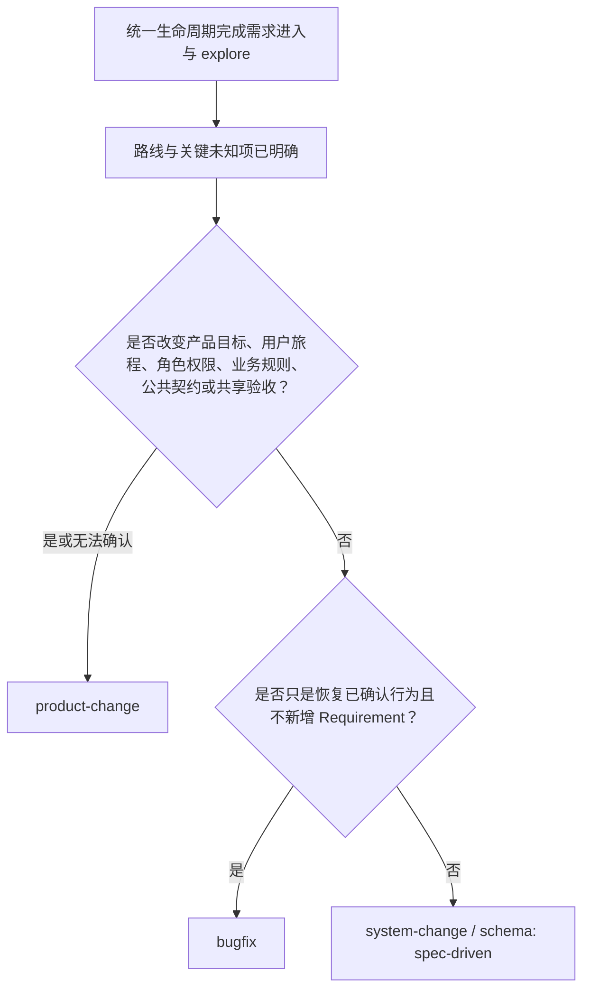
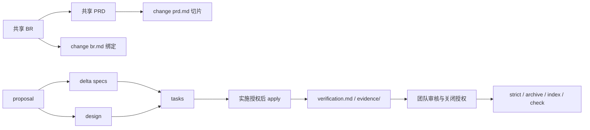
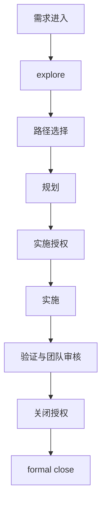

# AI 全栈 OpenSpec 工作流

一套面向 AI 协作开发的可移植交付工作流：OpenSpec 管理 change 内的可执行行为与本地归档，精简 BR/PRD/FEATURE 管理外层产品目标，change 内 `verification.md` 支持团队审核，确定性索引与无路径历史 v1 保存当前导航和 Requirement 演变。（推荐与gitnexus协同使用）

当前首次公开发行：`v0.0.1`。兼容 Node.js `>=20.19.0`，使用 OpenSpec `1.8.0`（官方 commit `d57889664cab4f2f061d236ec3ff82a5578701bb`）。

`SPEC.md`、`openspec/specs/**`、活动 change 和本地 archive 服务于 AI、OpenSpec 或交付过程；使用者不需要阅读它们来拼接工作流。

## 目录

- [AI 全栈 OpenSpec 工作流](#ai-全栈-openspec-工作流)
  - [目录](#目录)
  - [注意事项](#注意事项)
  - [工作流与技能协作](#工作流与技能协作)
  - [五分钟安装](#五分钟安装)
    - [前置条件](#前置条件)
    - [PowerShell](#powershell)
    - [Bash](#bash)
  - [选择工作流路径](#选择工作流路径)
  - [Artifact graph 与事实来源](#artifact-graph-与事实来源)
  - [实施授权与关闭授权](#实施授权与关闭授权)
    - [实施授权](#实施授权)
    - [关闭授权](#关闭授权)
  - [统一生命周期](#统一生命周期)
  - [Stable Requirement ID 治理](#stable-requirement-id-治理)
  - [Bugfix](#bugfix)
  - [System change](#system-change)
  - [Product change](#product-change)
    - [1. 建立共享需求包](#1-建立共享需求包)
    - [2. 创建和规划](#2-创建和规划)
    - [3. 实施、验证和交付声明](#3-实施验证和交付声明)
  - [验证记录与团队审核](#验证记录与团队审核)
  - [正式关闭](#正式关闭)
    - [源仓库](#源仓库)
    - [安装目标](#安装目标)
    - [已经提前 sync](#已经提前-sync)
    - [归档后 finalization 失败](#归档后-finalization-失败)
  - [程序门禁与团队治理](#程序门禁与团队治理)
  - [命令参考](#命令参考)
    - [源仓库](#源仓库-1)
    - [安装目标](#安装目标-1)
    - [常用 OpenSpec 命令](#常用-openspec-命令)
  - [CI 接入](#ci-接入)
  - [安装器与升级](#安装器与升级)
    - [安装内容](#安装内容)
    - [冲突与备份](#冲突与备份)
    - [旧文件退役](#旧文件退役)
  - [目录结构](#目录结构)
  - [故障排查](#故障排查)
  - [相关文档](#相关文档)

## 注意事项

1. 当前行为只在 `openspec/specs/<capability>/spec.md` 定义。
2. change 只描述增量，不复制完整当前规格。
3. 所有变更遵循固定统一生命周期：需求进入 → OpenSpec 原生 explore → 路径选择 → OpenSpec 原生规划 → 实施授权 → OpenSpec 原生 apply → 验证与团队审核 → 关闭授权 → 本项目 formal close。
4. product-change 的 BR/PRD 是 OpenSpec graph 外的产品治理；proposal 仍是原生独立 root。
5. 规划完成不等于允许实施；必须等待后续明确的 change-scoped 实施授权。
6. 实施完成不等于允许关闭；必须经过团队审核并等待后续明确的关闭授权。
7. `verification.md` 是团队材料，不是机器合同或 CI 门禁。
8. formal close 只负责 strict validation、archive、索引/历史重建和治理检查。
9. 已归档 change 按团队流程不可变；历史修正使用新的 delta change。
10. 本工作流源仓库不发布自身的详细开发过程记录；安装目标是否跟踪自己的 change、归档和需求包由目标团队决定。

## 工作流与技能协作

对代码、产品行为或系统行为的变更，本工作流是目标项目唯一的 change 交付生命周期。OpenSpec 原生 `explore/propose/update/apply/sync` skills 是该生命周期的主要执行引擎，不属于外部并行 workflow；路径选择、实施授权、验证、关闭审核与正式关闭仍由本项目治理。其他 workflow 或 skill 可以承担调试、影响分析、评审、发布等有界任务，但不能建立平行生命周期或绕过授权。

这不会取消更高优先级指令，也不会替代项目强制的安全、发布、迁移、运维或领域规则。AI 发现实质冲突时，应报告冲突来源、规则、影响、适用优先级和建议方案；无法消解时暂停相关实施并等待用户决定。skills 只在用户、平台或任务需要时加载，不预读无关内容。

GitNexus 推荐用于大型或陌生代码库的探索、影响分析、调试与重构。使用前先检查仓库上下文与索引新鲜度，再选择任务匹配的能力；不可用时回退到代码搜索和测试。其输出只是辅助线索，不替代 specs、代码、测试、verification、团队审核或任何程序门禁。

完整生命周期和原生 `openspec-explore`（不同平台可显示为 `/opsx:explore`、`/openspec-explore` 或 `$openspec-explore`）的触发、读取范围、退出条件、停点与豁免，以[统一生命周期](https://github.com/haoranliu66/openspec_workflow/blob/main/docs/FULLSTACK_WORKFLOW.md#4-统一生命周期)为准；本页不维护第二份完整规则。

## 五分钟安装

### 前置条件

- Git
- Node.js `>=20.19.0`
- npm

无需预装全局 OpenSpec。仓库的 `vendor/openspec` submodule 是固定 commit 的官方源码 checkout；`npm ci` 安装同版本官方运行时，安装器向目标项目分发固定运行时和核心 skills。

### PowerShell

安装直接从 GitHub 下载，不依赖本地工作流仓库路径：

```powershell
$repoUrl = "https://github.com/haoranliu66/openspec_workflow.git"
$targetProject = "D:\path\to\your-project"
$download = Join-Path ([System.IO.Path]::GetTempPath()) ("openspec-workflow-" + [guid]::NewGuid())

git clone --depth 1 --recurse-submodules $repoUrl $download
Push-Location $download
npm ci
npm run build
node dist/bin/workflow.js install --target $targetProject
Pop-Location

Set-Location $targetProject
node bin/openspec.js --version
node scripts/validate-schemas.js
node scripts/openspec-governance.js check
```

确认安装后，可自行删除临时下载目录。

### Bash

```bash
repo_url="https://github.com/haoranliu66/openspec_workflow.git"
target_project="/path/to/your-project"
download="$(mktemp -d)"

git clone --depth 1 --recurse-submodules "$repo_url" "$download"
cd "$download"
npm ci
npm run build
node dist/bin/workflow.js install --target "$target_project"

cd "$target_project"
node bin/openspec.js --version
node scripts/validate-schemas.js
node scripts/openspec-governance.js check
```

安装器复制 OpenSpec `1.8.0` 生产运行时、`bin/openspec.js`、`.agents/skills` 下的原生核心 skills、项目治理版 archive skill、bugfix/product-change Schema、共享需求模板、核心指南和 emitted JavaScript。它生成初始 `SPEC.md` 与 `openspec/change-history.json`；根 `AGENTS.md` 缺失时只创建为项目自有种子。system-change 使用固定运行时内置 spec-driven，product-change 使用项目 Schema，但二者都由同一套原生核心 skills 读取 artifact graph。

## 选择工作流路径



| 路径 | 使用条件 | OpenSpec graph | 产品材料 |
|---|---|---|---|
| `bugfix` | 恢复已确认行为，不新增 Requirement | `proposal -> specs -> tasks` | 无共享 BR/PRD/FEATURE |
| `system-change` | 有限、可观察、非产品治理的系统行为 | `proposal -> {specs ∥ design} -> tasks` | 无共享 BR/PRD/FEATURE |
| `product-change` | 任一产品治理面或公共契约变化 | `proposal -> {specs ∥ design} -> tasks`，另有 `br -> prd` 扩展 | 共享 BR/PRD/FEATURE |

代码量不是主判据。小型权限或业务规则变化仍是 product-change；有限缓存、调度或内部协议行为可以是 system-change。

## Artifact graph 与事实来源



事实来源：

| 信息 | 事实来源 |
|---|---|
| 产品目标与结果级验收 | `docs/requirements/REQ-*/BR-*.md`、`PRD-*.md` |
| 当前可执行行为 | `openspec/specs/<capability>/spec.md` |
| 本次行为增量 | `openspec/changes/<change>/specs/<capability>/spec.md` |
| 技术决策 | 当前 change 唯一 `design.md` |
| 实现计划和状态 | 源代码与 `tasks.md` |
| 测试、风险、限制和证据 | 当前 change 的 `verification.md`、可选 `evidence/` |
| 产品交付结论 | 共享 `FEATURE.md` |
| AI 导航与归档摘要 | 自动生成的 `SPEC.md`、`openspec/change-history.json` v1；不是下游使用文档 |

本仓库自身的 `docs/requirements/REQ-*`、活动/归档 change 详情、验证 evidence、GitNexus 索引、AI 规划记录、工作流备份、隔离 worktree、测试临时输出和日志均属于本地开发资料，受根目录 `.gitignore` 排除。该规则保证正常 Git staging 不会加入这些内容；维护者提交前仍须检查 tracked/staged 路径，不得通过 `git add -f` 主动发布被排除资料。本项目不新增 CI、脚本或 hook 来强制阻止这种显式绕过。这个上游策略不由安装器复制到目标项目。

## 实施授权与关闭授权

### 实施授权

当前 Schema 的 apply-required artifacts 及依赖闭包完成或实质修改后，AI 必须展示准确 change ID、范围、可观察行为、关键决策、风险和任务摘要；包含 Requirement delta 时还必须展示新增、沿用、重命名和冲突的 stable ID 结论。然后结束当前轮次。

后续 `/opsx:apply <change>`、`确认实施 <change>`，或针对唯一明确 change 的无歧义确认才构成实施授权。原始开发请求、创建 change、artifact 生成、`/opsx:continue`、`/opsx:ff` 或普通“继续”不构成授权。

范围、行为、接口、数据、安全、迁移、回滚或任务边界发生实质修改时，旧实施授权失效。格式、链接、证据附加、checkbox 和实现备注不使其失效。

### 关闭授权

完成验证后，AI 必须展示：

- 准确 change ID；
- 已交付和测试的范围；
- 测试与 evidence 摘要；
- 未完成 tasks、限制和交付影响；
- security、migration、browser、rollback 的审核结论；
- Requirement stable ID 的分配、沿用、重命名和冲突结论；
- 产品声明和回滚情况；
- formal close 将执行的步骤。

然后结束当前轮次。后续 `确认关闭 <change>` 或等价明确指令才授权 formal close。实施授权、tasks 完成、生成 verification、提前 sync 或普通“继续”都不构成关闭授权。

两类授权都属于团队/AI 协作治理，不生成 approval 文件，也不由 Schema 或 CI 证明。

## 统一生命周期

固定顺序是：

> 需求进入 → explore → 路径选择 → 规划 → 实施授权 → 实施 → 验证与团队审核 → 关闭授权 → formal close

以下图示仅为入口摘要。每个阶段的完整规则，特别是原生 `openspec-explore` 的适用与豁免边界，以 [`docs/FULLSTACK_WORKFLOW.md` 的统一生命周期章节](https://github.com/haoranliu66/openspec_workflow/blob/main/docs/FULLSTACK_WORKFLOW.md#4-统一生命周期)为准。



## Stable Requirement ID 治理

生成或实质修改 delta Requirement 前，AI 与团队必须盘点三类来源：当前 canonical capability spec、修改同一 capability 的全部活动 changes，以及 `openspec/change-history.json` 中的 Requirement-level 历史。详细 archive 不是必需输入。

- **ADDED**：不得复用已分配给其他逻辑 Requirement 的 ID；数字后缀默认使用同 capability/prefix 历史最大值加一，不填补旧空洞。
- **MODIFIED**：必须沿用现有 stable ID。
- **RENAMED**：只修改名称时必须沿用 stable ID。只有纠正确认错误时才允许更换，并记录冲突来源、新 ID 依据和历史保留方式。
- **授权与审核**：计划摘要和关闭审核都必须展示新分配、沿用、重命名及冲突结论。发现冲突后对 delta 的实质修正会使旧实施授权失效。

这些规则依靠 AI 与团队评审执行。OpenSpec strict validation、Schema、脚本、CLI、CI 和 formal close 不解析或证明 stable ID 的语义唯一性；验证通过不能替代该审核。

## Bugfix

```bash
node bin/openspec.js new change fix-login-timeout --schema bugfix
```

1. 在 `proposal.md` 说明缺陷、已确认预期行为、范围、非目标、风险和回滚。
2. 先按上述三源规则盘点 stable ID，再让 delta spec 沿用受影响 Requirement ID，并写完整修改后 Requirement 和 WHEN/THEN 场景。
3. `tasks.md` 只包含根因、修复、聚焦回归、验证和交付工作。
4. 完整规划后等待明确实施授权。
5. 实施后在 `verification.md` 记录回归用例、实际结果、风险和限制。
6. 团队审核并明确授权关闭。
7. 运行正式关闭命令。

若调研需要新增系统行为，升级为 system-change；触及产品治理面时升级为 product-change。

## System change

system-change 是治理名称，实际创建时使用原生 Schema：

```bash
node bin/openspec.js new change add-cache-policy --schema spec-driven
```

通过 `openspec-propose` 生成 proposal、specs、design、tasks 后等待实施授权，再由 `openspec-apply-change` 实施。实施和验证后使用同样的 change-local verification 与关闭审核，不创建共享 BR/PRD/FEATURE，也不创建 `closeout.json`。spec-driven 来自受管 OpenSpec runtime，不在项目的 `openspec/schemas/` 下创建 fork。

## Product change

### 1. 建立共享需求包

```text
docs/requirements/REQ-123-operations-console/
├── README.md
├── BR-123.md
├── PRD-123.md
└── FEATURE.md
```

共享 BR/PRD 应由团队在 change 启动前完成和确认。这个顺序是流程治理，不是 Schema 或 CI 门禁。

### 2. 创建和规划

```bash
node bin/openspec.js new change add-operations-console --schema product-change
```

1. `br.md` 绑定共享 BR 与业务目标。
2. `prd.md` 绑定共享 PRD、交付切片和结果级验收。
3. proposal 定义 change 的动机、行为变化、capabilities 和影响。
4. specs 与 design 在 proposal 后并行，tasks 等待两者。
5. 完整规划后展示摘要并等待后续实施授权。

### 3. 实施、验证和交付声明

实施后把详细验证写入 change。特别注意，对于改动面较大的需求，应拆分为多个独立的changes读取相对应上下文，再更改对应模块。团队人工核对 delta Requirement、PRD acceptance 和共享 FEATURE。只有有实现和验证依据的结果才能标记 `ready`；共享 FEATURE 不再被 formal close 自动解析。

## 验证记录与团队审核

推荐结构：

```text
openspec/changes/<change>/
├── proposal.md
├── design.md
├── tasks.md
├── specs/
├── verification.md
└── evidence/
    ├── focused-test.md
    └── screenshots/
```

推荐 `verification.md` 模板：

```markdown
# Verification

## Delivered scope

- Requirement/acceptance/result references and actual delivered behavior.

## Test cases

| ID | Scenario | Command or steps | Expected | Actual | Result |
|---|---|---|---|---|---|
| TC-001 | ... | ... | ... | ... | passed |

## Risk applicability

| Area | Applicable | Review conclusion | Evidence |
|---|---|---|---|
| Security | yes/no | ... | ... |
| Migration | yes/no | ... | ... |
| Browser | yes/no | ... | ... |
| Rollback | yes/no | ... | ... |

## Incomplete work and limitations

- None, or explain reason, delivery impact, affected claims and follow-up.

## Rollback

- Recovery procedure and validation.
```

这是推荐结构，不是固定 parser 契约。团队可以按项目需要调整，只要审核者能够判断实际完成情况。

## 正式关闭

### 源仓库

```bash
npm run build
node dist/bin/workflow.js close <change> --target .
```

### 安装目标

```bash
node bin/workflow.js close <change> --target .
```

固定执行顺序：

1. 受管 OpenSpec runtime 执行 `validate <change> --strict`；
2. 受管 OpenSpec runtime 执行 `archive <change> --yes --json`；
3. 重建 `SPEC.md` 和 `openspec/change-history.json`；
4. 运行治理检查。

formal close 不读取 `tasks.md`、`verification.md`、`evidence/`、BR/PRD/FEATURE 或历史 `closeout.json`。

索引器将本地新归档合并到 `change-history.json`。

### 已经提前 sync

正常路径不提前 sync，由 archive 应用 delta。如果已经明确执行过 sync，只在恢复场景使用：

```bash
node bin/workflow.js close <change> --skip-specs --target .
```

### 归档后 finalization 失败

若 archive 成功但 index/check 失败，命令会明确报告 change 已归档。修复原因后运行：

```bash
node bin/workflow.js index --target .
node bin/workflow.js check --target .
```

不要重复归档。

## 程序门禁与团队治理

| 检查 | 执行方 | 是否阻止 formal close |
|---|---|---|
| 显式 change 的 OpenSpec strict validation | 程序 | 是 |
| OpenSpec archive/delta 应用 | 程序 | 是 |
| 索引/历史重建和治理检查 | 程序 | 失败时报告已归档并要求恢复 |
| tasks 是否完成或结构是否合理 | 团队 | 不由程序判断 |
| 测试/evidence 是否充分真实 | 团队 | 不由程序判断 |
| 四项风险适用性 | 团队 | 不由程序判断 |
| Requirement/PRD/FEATURE 追踪 | 团队 | 不由程序判断 |
| 未完成项、限制和回滚可接受性 | 团队 | 不由程序判断 |
| 是否授权关闭 | 团队/用户 | AI 必须等待明确授权；无程序证明 |

团队治理不是“可忽略建议”。它仍是关闭前必须遵守的流程，只是不伪装成程序能够证明的事实。

## 命令参考

### 源仓库

| 命令 | 用途 |
|---|---|
| `npm ci` | 安装锁定依赖 |
| `npm run build` | 编译 TypeScript 到不跟踪的 `dist/` |
| `npm run skills:adapt` | 将重新生成的上游 core skills 接到本地 launcher，并恢复 archive 治理 wrapper |
| `npm test` | 构建并运行 compiled tests |
| `npm run verify` | 完整构建、测试、索引、治理、Schema 和活动 change 校验 |
| `npm run index` | 重建导航与 compact history v1 |
| `npm run check` | 治理检查 |
| `npm run validate:schemas` | 校验 bugfix、product-change 和内置 spec-driven |
| `npm run validate:changes` | 对全部活动 change 执行 strict validation |
| `node dist/bin/workflow.js install --target <project>` | 安装或升级目标项目 |
| `node dist/bin/openspec.js <args>` | 使用源码仓库固定的 OpenSpec runtime |
| `node dist/bin/workflow.js close <change> --target .` | 正式关闭单个 change |

### 安装目标

| 命令 | 用途 |
|---|---|
| `node scripts/openspec-governance.js index` | 重建导航与历史 |
| `node scripts/openspec-governance.js check` | 治理检查 |
| `node scripts/validate-schemas.js` | Schema 校验 |
| `node scripts/validate-changes.js` | 全部活动 change strict validation |
| `node bin/openspec.js <args>` | 使用安装目标固定的 OpenSpec runtime |
| `node bin/workflow.js close <change> --target .` | strict/archive/index/check |

项目不再提供 `validate:close`。

### 常用 OpenSpec 命令

```bash
node bin/openspec.js new change <change> --schema bugfix
node bin/openspec.js new change <change> --schema spec-driven
node bin/openspec.js new change <change> --schema product-change
node bin/openspec.js status --change <change>
node bin/openspec.js validate <change> --strict
```

## CI 接入

工作流源仓库：

```yaml
- uses: actions/setup-node@v4
  with:
    node-version: 20.19.0
    cache: npm
- run: npm ci
- run: npm run verify
```

安装目标：

```yaml
- run: node scripts/validate-schemas.js
- run: node scripts/validate-changes.js
- run: node scripts/openspec-governance.js check
```

CI 验证代码、OpenSpec 结构和生成文件一致性。它不应宣称证明团队关闭授权、tasks 完成、证据充分性或产品语义。

## 安装器与升级

### 安装内容

- `.ai-workflow/openspec-runtime/` 中的固定 OpenSpec 生产依赖闭包；
- `bin/openspec.js` 项目内 launcher；
- `.agents/skills/` 下的 OpenSpec core skills，以及接管关闭授权/formal close 的 archive wrapper；
- `bin/workflow.js`；
- governance、Schema validation 和 active-change validation scripts；
- close workflow、installer、OpenSpec runner、history 和 Schema alignment JavaScript；
- bugfix/product-change Schema 与 templates；
- requirements templates；
- full workflow 与 quality gates 指南；
- 安装目标 AI 治理指南 `docs/AI_WORKFLOW_AGENTS.md` 与根合并样例 `AGENTS.ai-workflow.example.md`；
- `SPEC.md` 和 `openspec/change-history.json`。

不安装 closeout validator、`validate-close.js`、closeout JSON templates，也不在 `openspec/schemas/` 下 fork spec-driven。
安装器也不复制本源仓库的 `.gitignore`，不会删除、忽略或停止跟踪目标项目自己的 change、archive、REQ、verification、evidence 或 `artifacts/**`。

### 冲突与备份

- 内容相同：跳过。
- 内容冲突：默认在写入前整体失败。
- `--force`：在 `.ai-workflow-backup/<timestamp>/` 备份后覆盖。
- 已有 OpenSpec config：保留，并生成 merge example。
- 根 `AGENTS.md` 不存在：从合并样例创建项目自有种子，但不写入 workflow manifest。
- 根 `AGENTS.md` 已存在：包括 `--force` 在内始终原样保留，并提示团队审阅最新合并样例。
- 任意嵌套 `AGENTS.md`：安装器不枚举、不备份、不覆盖也不删除。

### 旧文件退役

升级时读取旧 `.ai-workflow.json`。只有同时满足以下条件的文件才会退役：

1. 路径位于代码内的明确 closeout 退役清单；
2. 旧 manifest 将该路径列为 workflow-managed；
3. 目标文件当前存在。

退役前总是备份并在安装结果中报告。未受管同名文件、活动/归档 changes、历史 `closeout.json`、`verification.md`、`evidence/` 和 `artifacts/**` 都不会删除。

## 目录结构

```text
.
├── AGENTS.md
├── SPEC.md                         # 自动生成
├── README.md
├── bin/                            # TypeScript CLI source
├── .agents/skills/                 # 固定上游 core skills 与 archive 治理 wrapper
├── vendor/openspec/                # pinned OpenSpec 官方源码 submodule
├── lib/                            # TypeScript runtime source
├── scripts/                        # TypeScript maintenance source
├── tests/                          # compiled test source
├── examples/core-workflow/        # 三条路径的完整示例
├── docs/
│   ├── requirements/
│   │   └── _templates/             # 公开模板；上游自己的编号 REQ 不发布
│   ├── ADOPTION.md
│   ├── AGENTS.root.example.md      # 上游种子源；安装为根合并样例
│   ├── AI_WORKFLOW_AGENTS.md       # 安装器维护的 AI 执行约束
│   ├── DOCUMENTATION_MAP.md
│   ├── FULLSTACK_WORKFLOW.md
│   ├── OPERATIONS.md
│   └── QUALITY_GATES.md
└── openspec/
    ├── config.yaml
    ├── change-history.json         # 自动生成
    ├── schemas/
    │   ├── bugfix/
    │   └── product-change/
    ├── specs/
    └── changes/
        └── archive/.gitkeep
```

## 故障排查

| 现象 | 是否阻止 | 处理 |
|---|---|---|
| `node bin/openspec.js validate <change> --strict` 失败 | 是 | 修复 artifact/delta 结构和场景 |
| `node bin/openspec.js --version` 不是 `1.8.0` | 是 | 重新执行当前版本安装器；不要调用 PATH 中的全局 OpenSpec |
| formal close 找不到 change | 是 | 确认活动 change ID 和路径 |
| archive delta 与当前规格冲突 | 是 | 解决 delta/canonical spec 冲突后重试 |
| archive 成功但 index/check 失败 | 已归档 | 修复后单独运行 index/check |
| `SPEC.md` 或 history 过期 | 治理失败 | 运行 index 并提交生成文件 |
| history JSON 无效、不是严格无路径 v1 或包含旧格式字段 | 是 | 从可信备份恢复当前 pathless v1 台账后再运行 index；命令不会强制覆盖 |
| active change 使用未知 Schema | 治理失败 | 使用 bugfix、product-change 或内置 spec-driven |
| 安装发现冲突 | 安装停止 | 人工合并或确认后使用 `--force` 备份覆盖 |
| 旧 closeout 文件没有自动删除 | 否 | 确认旧 manifest 是否拥有该路径；未受管文件需人工判断 |
| verification 缺少内容 | 程序不阻止 | 团队退回审核并补充，不应据此授权关闭 |


## 相关文档

- [完整执行流程](https://github.com/haoranliu66/openspec_workflow/blob/main/docs/FULLSTACK_WORKFLOW.md)
- [AI 工作流权威与技能协作](https://github.com/haoranliu66/openspec_workflow/blob/main/docs/AI_WORKFLOW_AGENTS.md)
- [质量门禁](https://github.com/haoranliu66/openspec_workflow/blob/main/docs/QUALITY_GATES.md)
- [接入指南](https://github.com/haoranliu66/openspec_workflow/blob/main/docs/ADOPTION.md)
- [维护手册](https://github.com/haoranliu66/openspec_workflow/blob/main/docs/OPERATIONS.md)
- [文档权威地图](https://github.com/haoranliu66/openspec_workflow/blob/main/docs/DOCUMENTATION_MAP.md)
- [核心流程完整示例](https://github.com/haoranliu66/openspec_workflow/blob/main/examples/core-workflow/README.md)
- [OpenSpec 官方仓库](https://github.com/Fission-AI/OpenSpec)

维护者在提交前运行：

```bash
npm run verify
git diff --check
```
