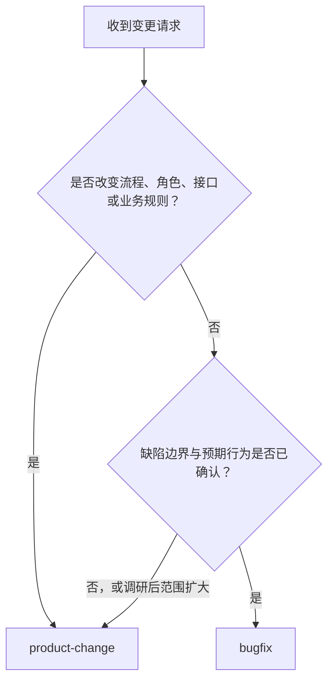
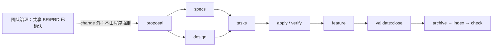

# AI 全栈 OpenSpec 工作流

一套面向 AI 协作开发的可移植交付工作流：用 OpenSpec 管理 change 内的可执行行为契约，用精简 BR/PRD 管理 change 外的产品目标，并以确定性的导航、历史和 closeout evidence 支持审查与关闭。

> 当前版本：`2.1.0`
>
> 环境下限：Node.js `>=20.19.0`、Git、npm、`@fission-ai/openspec@1.5.0`

## 目录

- [适用场景](#适用场景)
- [核心模型](#核心模型)
- [五分钟快速开始](#五分钟快速开始)
- [选择 bugfix 或 product-change](#选择-bugfix-或-product-change)
- [事实来源与 artifact graph](#事实来源与-artifact-graph)
- [完整交付生命周期](#完整交付生命周期)
- [完成第一个 bugfix](#完成第一个-bugfix)
- [完成第一个 product change](#完成第一个-product-change)
- [任务、证据与 FEATURE](#任务证据与-feature)
- [关闭单个 change](#关闭单个-change)
- [程序门禁与团队治理](#程序门禁与团队治理)
- [命令参考](#命令参考)
- [CI 接入](#ci-接入)
- [安装器与升级](#安装器与升级)
- [目录结构](#目录结构)
- [故障排查](#故障排查)
- [维护与相关文档](#维护与相关文档)

## 适用场景

本项目适合希望让 AI 参与实现、同时保留明确行为契约、验证证据和关闭审查的团队。它提供两条路径：

- 对边界明确的小缺陷使用 `bugfix`；
- 对新功能、跨角色流程、接口或业务规则变化使用 `product-change`。

它重点解决以下问题：

- AI 如何只加载当前任务需要的最小上下文；
- 产品目标、可执行行为、技术设计、实现状态和交付结论分别放在哪里；
- 多个 changes 如何共享 BR/PRD，而不在每个 change 中复制整套产品文档；
- 如何在关闭单个 change 前检查任务结构、质量 evidence、引用完整性和适用门禁；
- 如何确定性生成导航与机器历史，降低长期维护和审计成本。

本项目不是：

- 产品管理或需求评审的替代品；
- 合规认证、证据充分性或语义正确性的自动证明系统；
- `closeout.json.command` 的命令执行器；
- 通过 hash、base ref 或 full history 强制证明归档不可变的系统。

## 核心模型

工作流把规则分为三个层次。三者都应遵守，但执行方式不同。

| 层次 | 主要事实 | 执行方式 |
|---|---|---|
| 团队流程治理 | product change 前完成并确认共享 BR/PRD；无法实现、取消或延期 task 的用户确认；归档不得修改 | 团队评审与协作 |
| OpenSpec artifact graph | proposal、specs、design、tasks、feature 的生成和依赖关系 | OpenSpec Schema |
| 程序门禁 | strict validation、closeout 结构与引用、evidence 文件、适用 gate、生成文件漂移 | 脚本、CLI 与 CI |

事实按职责分层：

- BR/PRD 定义 change 外的业务目标、产品范围和结果级验收；
- specs 定义系统可执行行为，精确场景只在 specs 中维护；
- `design.md` 记录本 change 的技术决策；
- 源代码、`tasks.md` 和验证 evidence 共同反映实现状态；
- FEATURE 只记录有实现和验证证据支持的交付结论；
- `SPEC.md` 与 `openspec/change-history.json` 是生成的导航和历史，不得手工编辑。

## 五分钟快速开始

### 前置条件

- Node.js `>=20.19.0`
- Git 和 npm
- `@fission-ai/openspec@1.5.0` 已安装，并可通过 `openspec` 命令调用

### PowerShell

```powershell
$workflowRepo = "D:\path\to\ai-fullstack-openspec-workflow"
$targetProject = "D:\path\to\your-project"

Set-Location $workflowRepo
npm ci
npm run verify
node dist\bin\workflow.js install --target $targetProject

Set-Location $targetProject
node scripts\validate-schemas.js
node scripts\openspec-governance.js index
node scripts\openspec-governance.js check
```

### Bash

```bash
workflow_repo="/path/to/ai-fullstack-openspec-workflow"
target_project="/path/to/your-project"

cd "$workflow_repo"
npm ci
npm run verify
node dist/bin/workflow.js install --target "$target_project"

cd "$target_project"
node scripts/validate-schemas.js
node scripts/openspec-governance.js index
node scripts/openspec-governance.js check
```

`npm run verify` 是工作流源仓库的完整验证入口。源仓库维护 TypeScript，`dist/` 是不跟踪的编译产物；安装到目标项目的是 emitted JavaScript，因此目标项目不需要 TypeScript 或 ts-node。目标环境仍需提供 OpenSpec `1.5.0` CLI。

安装器会创建必要目录、安装两个 schemas 与模板、复制治理/校验脚本和标准指南，并生成初始 `SPEC.md` 与 `openspec/change-history.json`。已有文件的冲突和升级策略见[安装器与升级](#安装器与升级)。

## 选择 bugfix 或 product-change



| 选择 | 使用条件 | 原生核心流程 |
|---|---|---|
| `bugfix` | 缺陷边界明确、预期行为已确认，不改变流程、角色、接口或业务规则 | `proposal -> specs -> tasks -> apply` |
| `product-change` | 新功能、管理台、跨角色流程、接口/数据/权限变化或新增业务规则 | `proposal -> {specs ∥ design} -> tasks -> apply -> feature` |

只有同时满足以下条件时才使用 `bugfix`：

- 问题边界小且可观察；
- 预期行为已经确认；
- 不增加角色流程、接口契约或业务规则；
- 可用聚焦回归测试证明修复。

如果调研发现范围扩大，停止当前 bugfix，并迁移为 `product-change`。不要为了缩短 artifact 流程而把产品变化包装成 Bug。

## 事实来源与 artifact graph

| 问题 | 事实来源 |
|---|---|
| 为什么做、产品目标是什么 | `docs/requirements/REQ-*/BR-*.md`、`PRD-*.md` |
| 系统当前必须如何行为 | `openspec/specs/<capability>/spec.md` |
| 本 change 改变什么行为 | `openspec/changes/<change>/specs/<capability>/spec.md` |
| 技术上如何实现 | 本 change 唯一的 `design.md` |
| 实现与验证到了哪里 | 源代码、`tasks.md`、验证 evidence |
| 哪些能力已真实交付 | change `feature.md` 与共享 `FEATURE.md` |
| 去哪里找活动与历史上下文 | 生成的 `SPEC.md` 与 `openspec/change-history.json` |

BR/PRD 只表达外层产品目标和结果级验收。精确的 SHALL/MUST、WHEN/THEN 与异常行为只写在 specs 中。一个共享 BR/PRD 可以对应多个可独立交付的 changes。

AI 开始工作时按以下顺序加载上下文：

1. 读取根 `SPEC.md` 定位受影响 capability 和活动 change；
2. 只读取 `openspec/specs/` 下受影响的当前规格；
3. 读取修改同一 capability 的活动 changes；
4. 需要 Requirement 级演进时读取 `openspec/change-history.json`；
5. 只在回归、冲突或设计依据需要时读取相关 archive。

## 完整交付生命周期



product change 的关键关系如下：

- `proposal` 是独立 root，不依赖 change 内的 `br.md` 或 `prd.md`；
- change 内的 `br.md` 与 `prd.md` 只是共享文档的轻量绑定，`prd` 等待 `br`，但两者都不是 `proposal` 的前置；
- 团队在 change 外完成并确认共享 BR/PRD，该顺序不由 Schema、脚本或 CI 强制；
- `proposal` 完成后，`specs` 与唯一的 `design.md` 可并行；
- `tasks` 等待 specs 和 design，并作为 `apply` 的进度事实；
- `feature` artifact ready 只表示可以开始记录交付，不表示 change 已关闭；
- change 只有在校验、归档、导航/历史重建和治理检查完成后才关闭。

bugfix 不包含 product PRD/FEATURE 交付链，但仍需稳定的 delta Requirement ID、真实回归 evidence、四项 gate 适用性决策和标准关闭流程。
